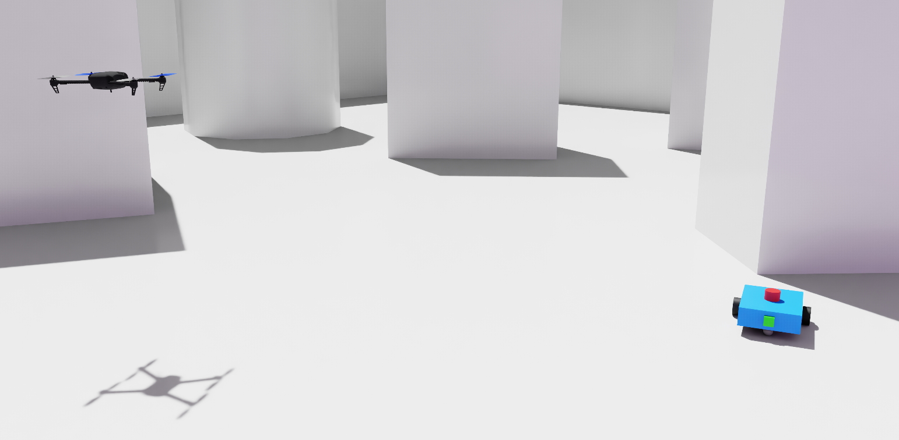
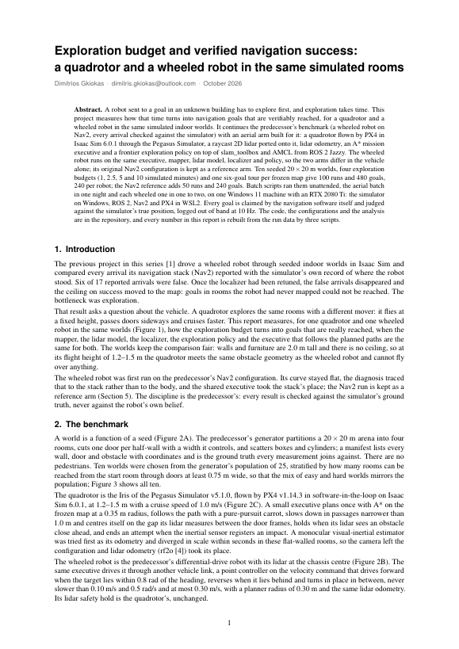
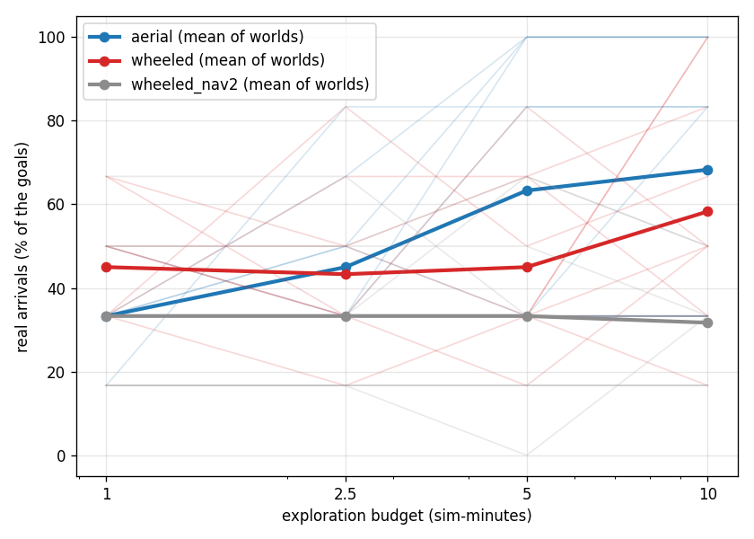
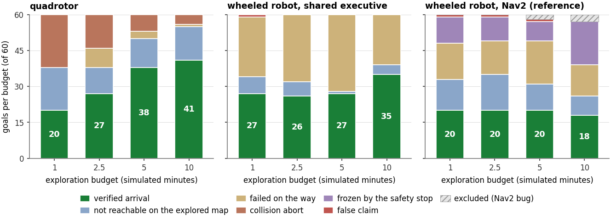
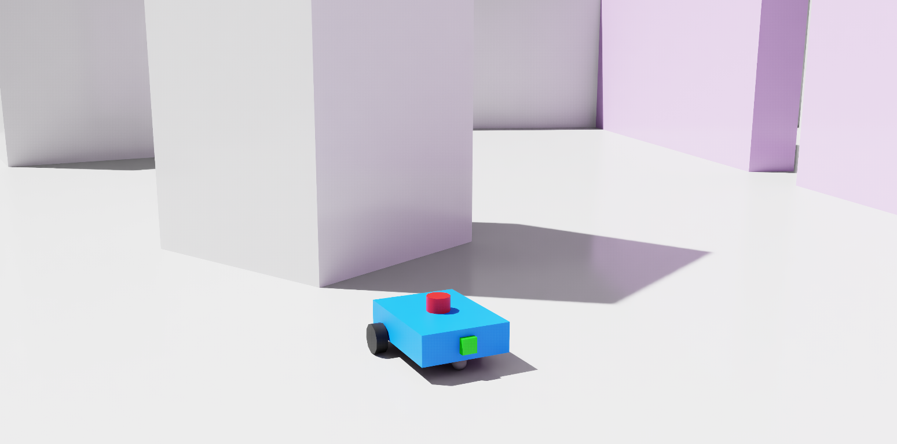
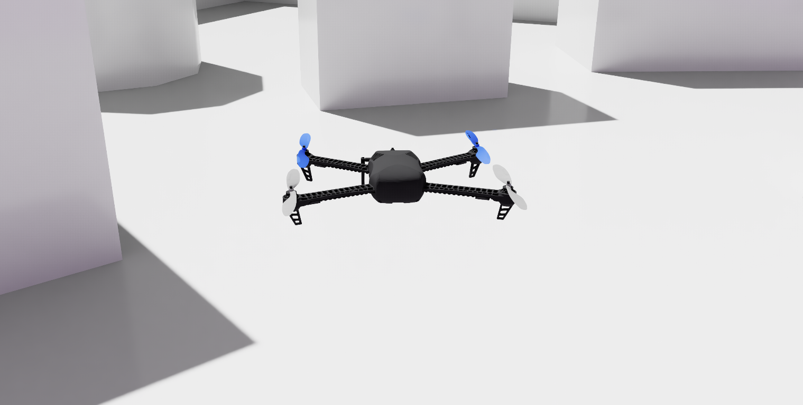
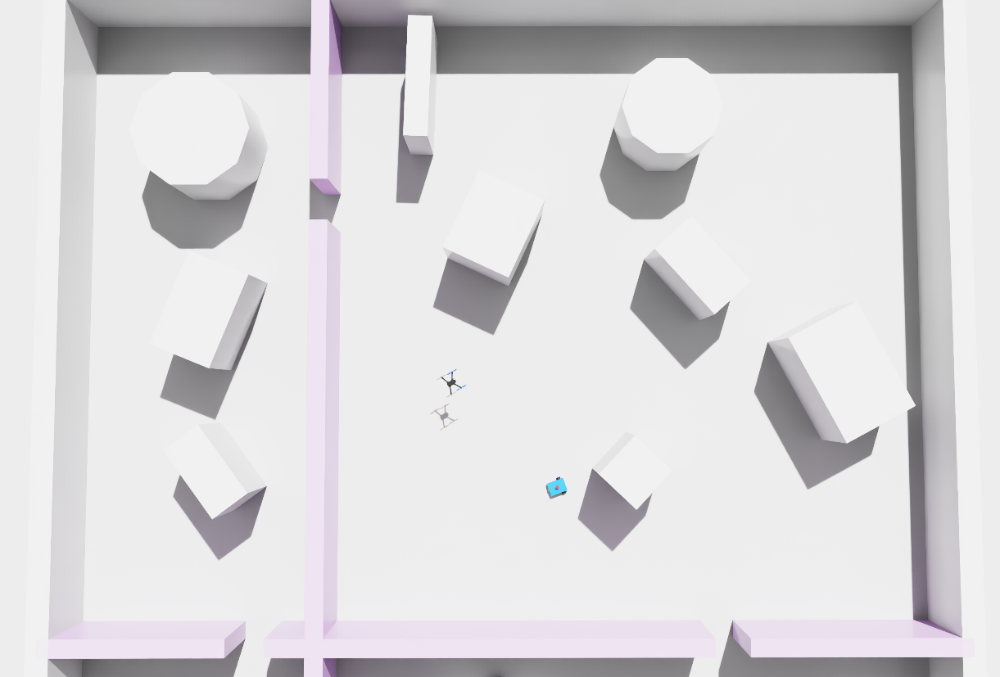

# aerial-explore-bench

A simulation benchmark that measures how the time a robot spends exploring an unknown building turns into navigation goals it verifiably reaches, for a quadrotor and a wheeled robot in the same seeded indoor worlds. Both robots share the mapper, the simulated lidar, the localizer, the exploration policy and the mission executive that follows the planned paths; what differs is the vehicle. The wheeled robot's original Nav2 stack is kept as a reference arm. Every claimed arrival is judged against the simulator's own record of where the robot was.



Ten seeded 20 × 20 m worlds, four exploration budgets (1, 2.5, 5 and 10 simulated minutes), one six-goal tour on each frozen map: 480 goals, 240 per robot, and another 240 for the Nav2 reference, run unattended by batch scripts on one Windows 11 machine with an RTX 2080 Ti (Isaac Sim 6.0.1 on Windows, Nav2 and PX4 in WSL2). The report is attached to the [release](https://github.com/d1mitrios/aerial-explore-bench/releases).

## Report and video

<p align="center">
  <a href="https://github.com/d1mitrios/aerial-explore-bench/releases/download/v1.0.0/report.pdf"></a>
</p>

The report ([PDF, 7 pages](https://github.com/d1mitrios/aerial-explore-bench/releases/download/v1.0.0/report.pdf)) describes the benchmark, the two robots and every result below. The video is a short demonstration of both robots in the benchmark's worlds:

https://github.com/user-attachments/assets/a7d9bf64-2a8b-4dfc-b361-4bb0221a617a

## What came out

| | |
|---|---|
|  |  |

The quadrotor's verified arrivals rose with the budget from 33 % of its goals at 1 min to 68 % at 10 min (20, 27, 38 and 41 of 60), and its map coverage from 169 to 245 m². The wheeled robot on the same executive reached 45, 43, 45 and 58 % (27, 26, 27 and 35 of 60) while its coverage grew from 136 to 246 m²: ahead of the quadrotor at 1 min, one goal behind at 2.5 min and behind it from 5 min on. The quadrotor made no false claim in 126; the wheeled robot made one in 116, caught by the judge. Its remaining failures are the localizer lost after the robot enters a room the frozen map does not contain, doors of 0.75 to 0.80 m where the lidar safety hold stops it, and doors the slam map draws too narrow for its 0.30 m planner radius. It also touches geometry its map does contain: 60 of its 160 contact episodes, 52 of them with the localizer right and 40 of those at door frames, with 5 cm between its 0.30 m planner radius and the 0.25 m its corners and wheels reach. The quadrotor's impacts fall from 56 to 12 with the budget because 98 of its 128 struck geometry its map did not yet contain (`analysis/collision_sources.py`).

On the predecessor's Nav2 stack, the reference arm, the same wheeled robot stayed at about a third (33, 33, 33 and 32 %; 20, 20, 20 and 18 real arrivals) while its coverage grew from 143 to 194 m². Its explorations rarely mapped the other rooms because the global planner found no path through the slam map's doors, and its tours timed out on two recorded stack behaviours: the planner sending the robot into obstacles never added to the global costmap, and the simulated drive not executing the slow turns in place the local controller kept commanding. 47 of its 240 goals were lost to freezes of the collision monitor's circular stop zone, 3 claims were false and 5 were void because of a bug in Nav2 1.3.12 that reports success when the goal's transform lookup fails. The report sums up the reference arm in a short section of its own.

## The two robots

| The wheeled robot | The quadrotor |
|---|---|
|  |  |
| The predecessor's differential-drive robot, a 0.40 × 0.30 m body, driven by the quadrotor's mission executive through a point controller on the velocity command, with lidar odometry (rf2o) and a 0.30 m planner radius. The reference arm runs it on the predecessor's Nav2 configuration (NavFn, DWB, the collision monitor, AMCL, wheel odometry with injected noise) with three corrections documented in the report. | The Iris of the Pegasus Simulator flown by PX4 SITL at 1.2 to 1.5 m, with a raycast 2D lidar ported onto it, lidar odometry (rf2o) and a small mission executive: A* on the frozen map, pure pursuit, doors passed sideways, an impact detector on the inertial sensor. |

The worlds are the predecessor's: a cross partition into four rooms, one door per half-wall of a controlled width, seeded boxes and cylinders, walls and furniture 2.0 m tall and no ceiling, so the quadrotor meets the same obstacles as the wheeled robot and the same 2D map serves both. A manifest per world lists every wall, door and obstacle with coordinates and is the ground truth every measurement joins against.



## How a run works

The robot explores once, on a clock that counts simulated time, with the frontier policy: pick the nearest frontier by path length, drive there, repeat; the map is frozen at 1, 2.5, 5 and 10 minutes while the run continues. Each frozen map then gets one tour of the world's goals in file order, scored on the first six (the aerial batch flew all ten, and the first six goals of a longer tour are exactly the six-goal tour), 240 s and one retry per goal, with AMCL localizing on that map. The stack claims each arrival by itself (Nav2's success signal, or the executive's own estimate within 0.35 m of the goal); the simulator writes the true position to a file at 10 Hz, out of band, and the analysis joins every claim with it: within 1.5 m of the goal is a real arrival, beyond it a false one, and a claim whose own estimate was more than 1.5 m off is void. Every goal also gets one outcome class from the logs (`analysis/goal_outcomes.py`), and the wheeled robot's contact with the geometry is read from the ground truth. The analysis reads the quadrotor from `runs/raw/batch`, the wheeled robot on the executive from `runs/raw/wbatch3` and the Nav2 reference from `runs/raw/wbatch2`.

## Layout

| Path | Contents |
|---|---|
| `worlds/` | The ten worlds: manifests (the ground truth) and maps, the world list with door widths and reachable rooms |
| `sim/` | The Isaac side: the quadrotor flight app with the raycast lidar and the ground-truth logger, the wheeled robot's stage and bootstrap, the launchers, the photo scene |
| `policies/` | The configurations both arms run on: Nav2 (the benchmark's and the outline variant), AMCL, slam_toolbox, rf2o, and OpenVINS for the optional VIO odometry |
| `missions/` | The frontier policy, the goal sets, the two robots' exploration and mission runners, the bring-up scripts, the batch runners, the offline mock harnesses |
| `analysis/` | The verdicts and every table and figure, all from the ground truth; `analysis/results/` holds the benchmark's tables |
| `docs/` | `INSTALL_PEGASUS.md`, the quadrotor's simulator setup (Pegasus on Isaac Sim 6.0.1, PX4, OpenVINS), and `images/`, screenshots of the two robots, of a world and of the report |
| `VERSIONS.md` | The pinned stack, with the build notes that made it work on this machine |

`worlds/`, `sim/`, `policies/`, `missions/` and `analysis/` each have their own README. Run data (`runs/raw/`) is not committed; the tables in `analysis/results/` are, and `analysis/README.md` gives the commands that rebuild them from the runs.

## Reproducing

The stack is pinned in [`VERSIONS.md`](VERSIONS.md): Isaac Sim 6.0.1, Pegasus Simulator v5.1.0 with a local port to Isaac 6, PX4-Autopilot v1.14.3, ROS 2 Jazzy with Nav2 1.3.12 and slam_toolbox, rf2o_laser_odometry at commit b38c68e, on Windows 11 with WSL2 (Ubuntu 24.04). The GPU used, an RTX 2080 Ti, is below Isaac Sim's stated minimum and ran the simulation at about 0.4 × real time; the budgets are in simulated time for that reason.

The batches run from WSL: `bash missions/batch_aerial.sh --all` and `bash missions/batch_wheeled.sh --stack shared --all --tour-limit 6` (without `--stack shared`, the Nav2 reference arm), each with a `--smoke` mode that runs one short world first and a `--dry-run` that lists the finished and pending runs (`missions/README.md`). The wheeled batches ran six goals per tour, the aerial batch all ten; the analysis scores the first six of every tour.

To look at a world with both robots before running anything (no ROS, no PX4), start Isaac Sim from the repo root in a fresh PowerShell, without `sim\env.ps1`:

```powershell
$env:AEB_WORLD_SEED = "20260723002"   # any of the ten seeds in worlds/manifests/
C:\isaacsim\isaac-sim.bat --exec sim\photo_scene.py --/app/file/ignoreUnsavedOnExit=true
```

Every world is rebuilt at launch from its manifest in `worlds/manifests/`, so the ten worlds need no scene files. The wheeled robot is `sim/wheeled/robot.usda`; the quadrotor is Pegasus's Iris, installed as in `docs/INSTALL_PEGASUS.md`. `sim/README.md` lists the launchers for a single run of either robot.

## Predecessor

This benchmark continues [sim-nav-benchmark](https://github.com/d1mitrios/sim-nav-benchmark), which took one wheeled robot from reactive wandering to goal-directed navigation on self-built maps and found that 6 of 17 reported arrivals were false, caught only by joining the claims against the simulator's ground truth; with the localizer retuned, the ceiling on success was the map, so the bottleneck was exploration. The worlds, the wheeled robot and its Nav2 configuration come from there. Code comments and configuration files call the predecessor the baseline.

## Citing

If you use the benchmark or its numbers, cite the report:

> D. Gkiokas, "Exploration budget and verified navigation success: a quadrotor and a wheeled robot in the same simulated rooms," technical report, 2026. https://github.com/d1mitrios/aerial-explore-bench

Releases carry the report and the demo video as assets.

## License

MIT, see [`LICENSE`](LICENSE), for everything in this repository except the configuration files below. They are adapted from the projects named and keep those projects' licenses:

| File | Adapted from | License |
|---|---|---|
| `policies/openvins/estimator_config.yaml` | [OpenVINS](https://github.com/rpng/open_vins), `config/rpng_sim` | GPL-3.0 |
| `policies/odom/rf2o_aerial.yaml` | [rf2o_laser_odometry](https://github.com/MAPIRlab/rf2o_laser_odometry) | GPL-3.0 |
| `policies/slam/slam_params.yaml` | [slam_toolbox](https://github.com/SteveMacenski/slam_toolbox) | LGPL-2.1 |
| `policies/nav2/nav2_params.yaml`, `policies/nav2/nav2_params_polygon.yaml` | [Nav2](https://github.com/ros-navigation/navigation2), `nav2_bringup` | Apache-2.0; the `amcl` section LGPL-2.1-or-later (`nav2_amcl`) |
| `policies/nav2/amcl_aerial.yaml` | [Nav2](https://github.com/ros-navigation/navigation2), `nav2_amcl` | LGPL-2.1-or-later |

`sim/aeb_flight.py` is adapted from the Pegasus Simulator example `examples/1_px4_single_vehicle.py` and keeps its BSD-3-Clause notice.

The simulators and ROS packages the benchmark runs on (Isaac Sim, Pegasus Simulator, PX4, ROS 2 and the packages above) are installed separately, as listed in [`VERSIONS.md`](VERSIONS.md), and are not part of this repository.
